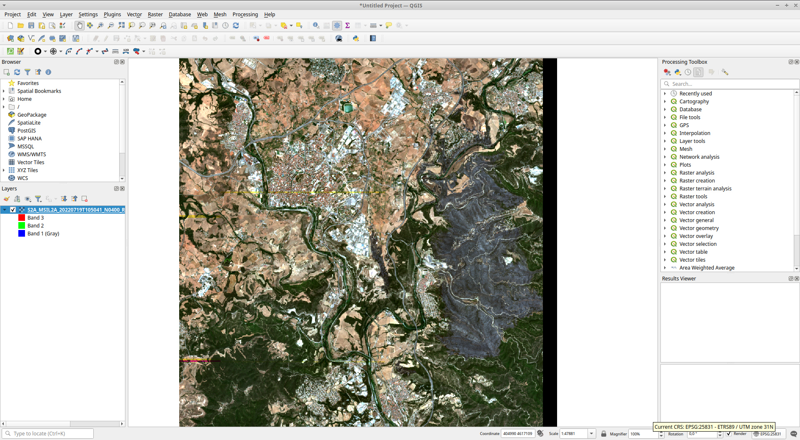

    
  
# IMFSE-practical UNIT 5 - WildFire Behavior Modelling - GIS

## Some simple exercises to get used to QGIS. 

### Objective:
- open tif file with QGIS
- undestant the importance of CRS
- get sentinel2 data from the copernicus server.
- sow exemple of image plotting with python (a notebook **TO COME**)

### REquirements: 
- QGIS installed

Data for this exercise is available [here](https://www.dropbox.com/scl/fi/nbmn7b88o7in95810xx8s/S2A_MSIL2A_20220719T105041_N0400_R051_T31TCG_20220719T170208_clipped_noBlackLine.tif?rlkey=ir3yb9rjyswoz2lf3x1p4ybdl&st=nevqv4qa&dl=0)

### QGIS First Use
Upload the tif file present in the link above. 
This tif file is a subset of the S2 data for the overpass of the 19 of July 2022 above el pont de vilomara.
Following the instruction in [howTo-SentinelData.pdf](https://www.dropbox.com/scl/fi/rxx156j63oc3raws02rks/howTo-SentinelData.pdf?rlkey=wchummnsefumebarbdv00cxff&st=ialrsuru&dl=0) you should be able to create this tif file.

Load Data in QGIS using “open source manager” 

go to the S2 tif file you downloaded from the dropbox

go to the properties menu of the loaded item

in this small subset of the S2 data from the fire of el pont de Vilomara you only have 3 bands.
There are no named in the file. (only band1, 2, and 3)

To display the true color composite image you need to reorder them as specified above.

Check the CRS in used at the bottom right of the QGIS windows. See above.
It is using epsg:25831
The original CRS of the S2 data.
CRS stands for Coordinate Reference System. (CRS=GCS+PCS)

Now change the CRS to WGS84 by clicking on icon on the bottom right.

What do you observe?

In the properties of the loaded item, you can also check that a CRS is referenced.

It is the CRS attached to the data.
Get back to the the epsg25831 CRS in your map. 

Now change the CRS of the data in the properties to WGS84.
What do you observe?

Can you now upload a shape file that was recorded the day of the visit in el pont de Vilomara?
Check the CRS?
It is the same as the map?
