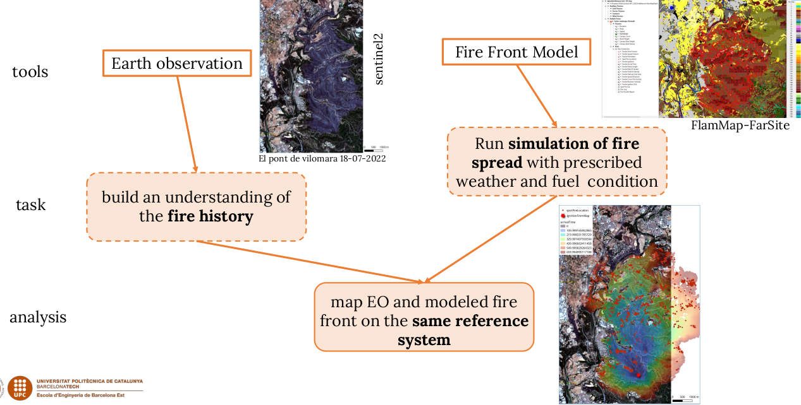
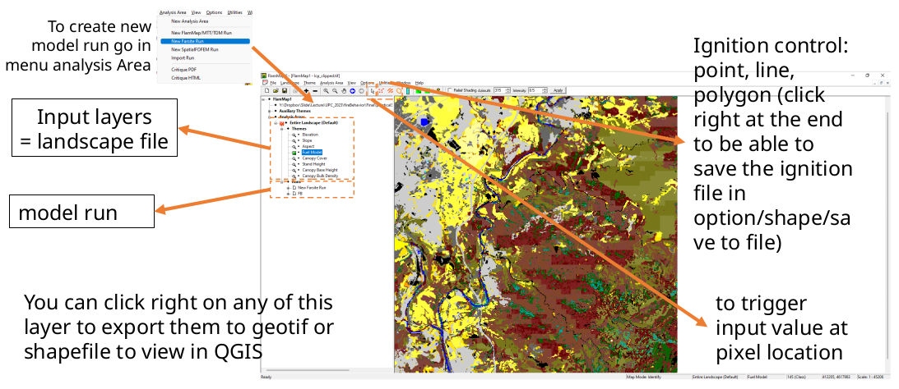

    

# IMFSE-practical UNIT 5 - WildFire Behavior Modelling - Flammap/Farsite
 

# An introduction to Run the Farsite model 

Data for this practical are here. you have
- Farsite Input layer for el pont de Vilomara – lcp_clipped.tif
- An extract of a report from the fire, to get some ambient condition  (**TO DO** I still need to select extract fromt the report)
- A video to go through a first run of Farsite

### The Objective 

We want here 
- to model fire front perimeter
- get an understanding of the fire history, using avaible data like satellite images or official repport
- use a GIS environment to compare model prediction and available data.

### Requirements: 
- Flammap
- QGIS

A video is available [here](https://www.dropbox.com/scl/fi/l991ncqrjt11hkg0ocyh9/runingFarsite.m4v?rlkey=49yveulwnaj6jc7afmjp7wg94&st=4yveuqiu&dl=0) to see an example of a farsite run.  
Below is simple presntation of the flammap model layout.

flammap gather several fire model. We focus here only on farsite. farsite only run on widows, It is installed on your desktop. It can also run on laptop, it requires very low cpu ressource. If you want to install it on yout laptop you can find it [here](https://www.firelab.org/project/flammap)

### Questions:

- Do you get the full extent of the burn area in one day with the same input parameter as in the video?

- Can you find parameter than can increase the fire behavior?

- Are they realistic? how the ambient condition compare with the value in the report.

- What do you think of the fuel model 145? Is this know to be well representative of Mediterranean shrub?

- Can you explain pattern in the fuel map? Several straight line shows up in the domain.

