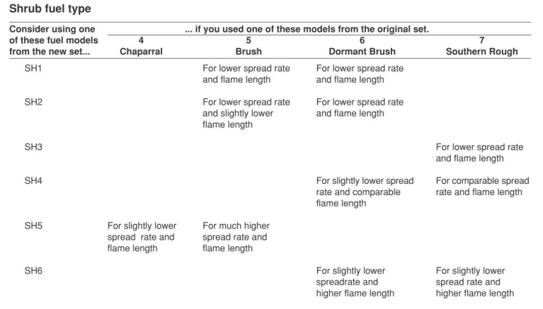
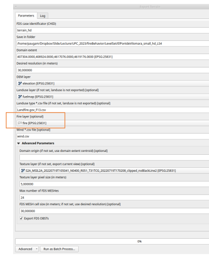

 <br/><br/><br/>
  
# IMFSE-practical UNIT 5 - WildFire Behavior Modelling - FDS-LS


## An introduction to Run FDS-LS

### Objectives: 
- run the fire of el pont de Vilomara with FDS-LevelSet (FDS-LS see [bova et al 206](https://www.fs.usda.gov/pnw/pubs/journals/pnw_2016_bova001.pdf))
- understant the limitation of FDS-LS
- run simple case showing the advantage of fire-atmospher coupled system

To run FDS-LS for el pont de vilomara fire, you need to fo through tree steps: 
1. convert lcp farsite file
2. create fds config file with qgis2fds plugin
3. run fds

Data and tools to run those 3 steps are available [here](https://www.dropbox.com/scl/fo/dab1in6l7yc0r95bqlc0a/h?rlkey=3o347nceyvqez8m90mhorc1ic&dl=0) or can be copied directlty from andromed
```
cd /data/MYUSER/IMFSE/imfse-practical4-FDSLS
cp /data/IMFSE/FBM_unit05/FDSLS/practical4.zip .
unzip practical4.zip
```

In all 3 steps, you have input files in the dropbox link. So that you can skip some step.

### 1. convert lcp Farsite input file to qgis2fds compatible file
run `lcp2fdsls.py` python script:
-  **input**=merged_clipped.tif, the file we used in the practical on Farsite
-  **output** = elevation.tif and fuelmap.tif

`lcp2fdsls.py` convert the 40 class of the fuel model from Scott and Burgan to Anderson-13 classes.
Conversion is not a one to one, see for example in [Scott and Burgan 2005](https://www.fs.usda.gov/rm/pubs/rmrs_gtr153.pdf)  



## 2. plugin qgis2fds
- **Input** : elevation.tif and fuelmap.tif, and config file in the link (wind, fuel map). You only need to create a shape file for the location of the fire. See orange square in image below. You also need to set the number of processor you ll be using in the FDS run. While andromeda can go to 96, as you are not alone on the machine, try here to keep small domain (25m resolution for example), and a max of 20 cpus for your setup.
- **Output**: terrain.fds, the config fire of fds.  


several video are in the directory `2-qgis2fds` to help you running the qgis plugin.


## 3. FDS run
If you use the configuration file you create with the qgis plugin, you need to update some parameter
- Time the fire start
- Duration of the simulation
- and the LS mode, if you use the mode fully coupled, then you need to activate the REAC namlist.
  
In the FDS run, see the difference between model LS=1 and LS=4.

To run FDS on andromeda, as you are sharing the same node with others, it is preferable to submit fds run thourhg the SLURM queue system.
in the  directory `3-fds_configFile` you have the script `run_fds.sh` that you can use to submit your job to the queue, simply run: 
```
$ sbatch run_fds.sh
```
Apart from `job-name` and `ntasks-per-node` that you should adjust to the number of mesh in you fds config file, do not change the otehr config parameter set with the `SBATCH` tag. you can see the status of your job by using
```
$ squeue
```
output are redirecting to the file `slurm-xxxx.out`

**TO BE CHANGED** for now moke view need to be run with `/opt/SMV/Build/smokeview/gnu_linux_64/smokeview_linux_64`. Itś very slow.


## Question:
Can you find a situation with a small domain, where wind recirculation might create a different fire spread in `LS=4` and `LS=1`.

